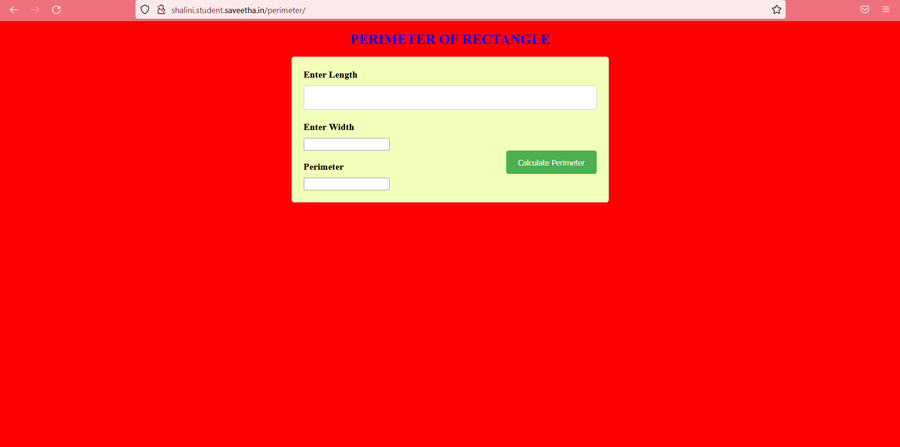

# Design a Website for Server Side Processing

## AIM:
To design a website to perform mathematical calculations in server side.

## DESIGN STEPS:

### Step 1:


### Step 2:


### Step 3:


### Step 4:


### Step 5:


### Step 6:

Publish the website in the given URL.

## PROGRAM :
```
<!DOCTYPE html>
<html lang="en">
    <head>
        <title>PERIMETER OF RECTANGLE</title>
        <style>
        form {
  width: 500px;
  margin: 0 auto;
  background-color: #F2FFBA;
  border: 1px solid #ccc;
  border-radius: 5px;
  padding: 20px;
}

label {
  display: block;
  font-size: 16px;
  font-weight: bold;
  margin-bottom: 10px;
}

input[type="text"],
input[type="number"] {
  width: 100%;
  padding: 12px 20px;
  margin-bottom: 20px;
  box-sizing: border-box;
  border: 1px solid #ccc;
  border-radius: 4px;
  resize: vertical;
}

input[type="submit"] {
  background-color: #4CAF50;
  color: white;
  padding: 12px 20px;
  border: none;
  border-radius: 4px;
  cursor: pointer;
  float: right;
}

input[type="submit"]:hover {
  background-color: #45a049;
}

.container {
  border-radius: 5px;
  background-color: orange;
  padding: 20px;
}

.perimeter {
  margin-bottom: 20px;
  color: olivedrab;
  font-size: 20px;
  font-weight: bold;
}
h1 {
  text-align: center;
  font-size: 24px;
  color: blue;
}
body{
    background-color: red
}

</style>
    </head>
            <body>
                <h1> PERIMETER OF RECTANGLE </h1>
                 <form method="POST" action="/perimeter/">
                    	
		 <label for="length">Enter Length</label>
         <input type="text" name="length" id="length" value="{{ length }}"/> <br>			
          <label for="width">Enter Width</label>
         <input type="width" name="width" id="width" value="{{ width }}"/><br>
          <input type="submit" value="Calculate Perimeter"/><br>

          <label for="perimeter">Perimeter</label>
         <input type="perimeter" name="perimeter" id="perimeter" value="{{ perimeter }}"/><br>
	</form>

            </body>
        
    
</html>
```

## OUTPUT:


### Home Page:



## Result:

